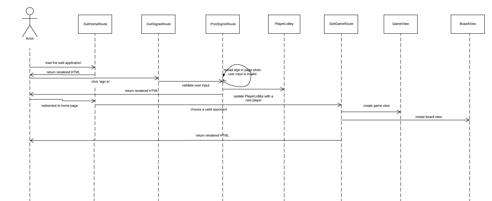
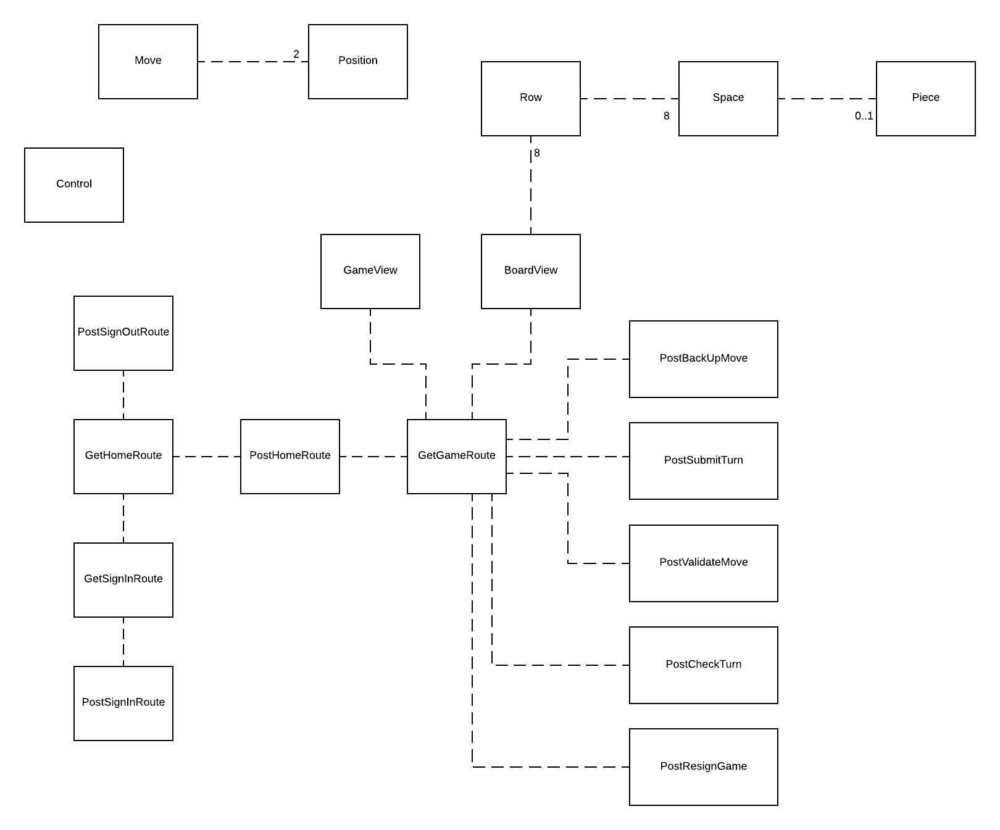

# PROJECT Design Documentation

## Team Information
* Team name: TEAM D - CYBER SLOTHS
* Team members
  * PAUL WOODS
  * JIAXIN WANG
  * JIWOO BAIK
  * HARSH TAGOTRA

## Executive Summary

The application must allow players to play Checkers with other players who are currently signed-in.
The game user interface will support a game experience using drag-and-drop browser capabilities for making moves.

### Purpose

This project will provide Checkers online globally to veteran Checker players and novices for entertainment
purposes.

### Glossary and Acronyms

| Term | Definition |
|------|------------|
| VO | Value Object |
| UI | User Interface|
| MVP | Minimal Viable Product |

## Requirements

This section describes the features of the application.

### Definition of MVP

Every player must sign-in before playing a game, and be able to sign-out when finished playing.
Two players must be able to play a game of checkers based upon the American rules.
Either player of a game may choose to resign, at any point, which ends the game.

### MVP Features

Movement
Player Sign-in
Start a Game
Gameplay

### Roadmap of Enhancements

Replay Mode: Games can be stored and then reviewed at a later date.
Spectator Mode: Other players may view an on-going game that they are not playing.
Multiple Games: A player may play more than one game at a time.
Player Help: Extend the Game View to support the ability to request help.
Tournament Play: Players can enter into checkers tournaments including player statistics.
AI Player: Players may play a game against an artificial intelligence player.
Asynchronous Play: Players can play asynchronously.

## Application Domain

This section describes the application domain.

## Architecture and Design

This section describes the application architecture.

### Summary

The following Tiers/Layers model shows a high-level view of the webapp's architecture.

As a web application, the user interacts with the system using a
browser.  The client-side of the UI is composed of HTML pages with
some minimal CSS for styling the page.  There is also some JavaScript
that has been provided to the team by the architect.

The server-side tiers include the UI Tier that is composed of UI Controllers and Views.
Controllers are built using the Spark framework and View are built using the FreeMarker framework.  The Application and Model tiers are built using plain-old Java objects (POJOs).

Details of the components within these tiers are supplied below.

### Overview of User Interface

This section describes the web interface flow; this is how the user views and interacts
with the WebCheckers application.

When I, as a user, am directed to the home page when I load the page. When I click the “sign-in” hyperlink, it takes me to the sign-in page. The page reloads given that I put invalid user name. It is redirected to the home page if I put valid user name and so I am successfully signed in. The home page now should list all the players signed in. When I click a user name to play a game, two things can happen. I get a warning message when I choose a player who is already playing a game with someone else. I start a game if the chosen player is available. I can also be chosen. In this case, I am directed to the game page directly from the home page. Once the game begins, it directs to the game page. If I started the game, it’s my turn and I can play my turn. If not, I wait for my turn. Every time I make a move, I have to wait for the validation. If my move is valid, my piece stays where I moved. If not, the piece goes back to its space before the move. After finishing the turn, I click the Submit button and the turn goes to my opponent. When the game is over, all the buttons except Exit button is disabled. I click Exit button to go back to the home page with a list of users.

### UI Tier

There are two big types of UI classes: Post, and Get. Post is for writing data. Get is retrieving data. For example, GetSigninRoute class retrieves data from user that the user clicked on the means to sign in and handle the event accordingly—putting sign in message and loading the view for the user. However PostSigninRoute class writes data so after it determines if the input, user name, is valid or not, it puts different output for the user. If it is valid, then it redirects to the home page. If not, it gives the user a warning message and a chance to put different user name again. GetHomeRoute handles the event of user directed to the homepage with displaying appropriate home view depending on the status of the user. PostHomeRoute either redirects the user to the game page and gives the opponent info that they are invited to the game or displays a warning message that the opponent is not available thus the game cannot be created. PostSignoutRoute handles the event when the user signs out. GetGameRoute gets that a user is trying to start a game so displays game page. The following sequence is how a user becomes a player and start a game. 

Webserver class is a bit different. It initializes the set of HTTP request handlers, all the routes. This defines the web application interface for the web application.

### Application Tier

Application Tier has GameCenter and PlayerLobby. GameCenter keeps track of all the ongoing games and PlayerLobby keeps track of all the players signed in. These two classes are passed to UI tier as parameters.

### Model Tier

There are nine classes in the model tier: BoardView, Control, GameView, Move, Piece, Player, Position, Row, Space. These classes interact with UI Tier to create a board and a player, to handle moves of players, and to play Checkers. The following is UML diagram of model tier and UI tier. Note that player is in the Application Tier’s UML diagram.

### Design Improvements

Since every GameView has to have a board, it will be better that GameView has BoardView instead of Route classes knowing both of the classes so it will adhere to the Law of Demeter.

## Testing

### Acceptance Testing

There are 7 user stories from the Sprint 1 and Sprint 2 and 6 of the user stories passed acceptance criteria tests. It includes pieces functioning as it should in the game, space in which a piece resides, a move from a user, and a board of the game. While the ground work for all the user stories, not all of them were completed yet. When a user can make a move, they should take the move no matter what. In the current implementation, it fails requiring the user to take the move.

### Unit Testing and Code Coverage

We created unit testing to see if information needed is actually created and availble to use. We focused on UI tier and Model tier unit testing. The program mostly runs from UI tier, displaying the game and Model tier, back-end development. By testing UI tier thouroughly, we made sure we are passing the required information to the view successfully. Model tier is tested as well to solidify the design and game logic. For Model tier test, we were able to reach 85% of code coverage. Considering the Move class is not fully developed yet, there is a room for growth but it has good coverage. For UI tier, we reached 49% coverage. We didn't test the Webserver and SessionTimeOutWatchDog class which is a huge drawback. Few of them are 100% covered and the others not so much. We covered 75% of Application Tier code. PlayerLobby is covered perfectly whereas GameCenter needs more work. We learned the usage and importance of unit testing and can test more detailed and accurately for the next Sprint. 

